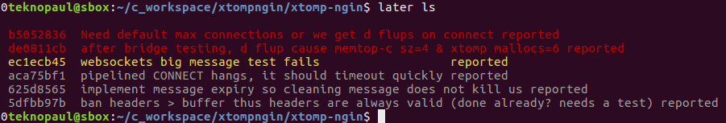

# Later for Linux

A command-line bug tracker, forked from (https://github.com/qznc/later)

Why? [discussion](https://news.ycombinator.com/item?id=1620168) because the venerable _sd_ has stopped working with latest Ubuntu releases.

# Install

Clone the github repository https://github.com/teknopaul/later.git

Install with

	sudo ./install

Set your _EDITOR_ variable.

## Usage

	later cmd [args]

_cd_ to your project directory.

	later init
	later bug "description here..."

Includes **/etc/bash_completion.d/later** so typing _later \[tab\]_ works as expected.

## Commands

- **init** - create .later dir in current directory
- **bug** "msg" - new bug
- **feat** "msg" - new feature
- **add** "msg" - new issue
- **ls** \<bug|feat\> - show unclosed issues ordered by priority
- **edit** \<guid\> - edit issue with the given guid
- **show|cat** \<guid\> - show issue \<guid\> completely
- **close** \<guid\> - set status to closed
- **confirm** \<guid\> - set status to confirmed
- **assign** \<guid\> \<developer\> - set responsible to developer
- **list** - show all issues in short form
- **help** \<cmd\> - shows documentation for \<cmd\>
- **schedule** - calculates/show deadlines
- **htmlreport** - generate html report
- **delete|del|rm** \<guid\> - delete issue \<guid\>
- **delete-closed** - delete all closed issues
- **list-subdirs** - show issue list of subdirs
- **revision** - manage revisions

## Storage

Later keeps issues in text files called _./.later/\<guid\>.issue_.  It will search up the directory tree to find the project's _.later_ directory similar to git. If you keep this directory in a project that already has source control your bugs and issues are versioned with the branch.  You can checkout and type _later ls_ to see which bugs apply this version of the code.  
If you want to see bugs across all versions of the code init _.later_ somewhere else and backup separately.

## Screenshot

Luks purty don' it.

